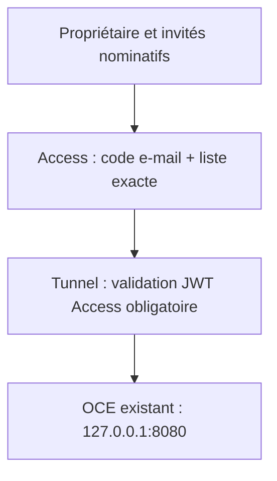

# OCE #58 — démo privée Cloudflare (préparation DEV 3)

État vérifié le 8 octobre 2026 : main
`85616225ce4878f501edd639ea06f74c314bb045`, CI/deploy DEV
[37730506837](https://github.com/Khaey/Dao/actions/runs/37730506837)
SUCCESS et plan OCE
[37730535800](https://github.com/Khaey/Dao/actions/runs/37730535800) SUCCESS.
La sauvegarde/restauration isolée, le digest OCE et le compte technique sont
qualifiés ; ne pas recommencer ces gates. Cloudflare `logiclab.fr` Active
est une déclaration du propriétaire dans #58, pas une recette Access/Tunnel.
Cette livraison prépare les opérations ; elle ne configure ni ne démarre
Cloudflare et ne prouve pas l'accès authentifié.

## Architecture et frontières



Topologie cible préparée, non activée. Ce tunnel est réservé à la démo ;
D.A.O reste la source de vérité métier. Aucun branchement produit D.A.O/OCE,
aucune modification Auth/RLS/Supabase, comptes démo, données, OVH/Resend,
DNS mail, Docker Compose, nftables ou passerelle produit dans cette PR.

Le service `dao-oce-cloudflared` utilise une identité Unix distincte. Son
jeton passe exclusivement par `LoadCredential`, jamais les arguments, logs,
variables D.A.O ou artefacts Actions. Le helper root installé ne prend qu'un
verbe fixe ; `dao` ne peut fournir ni jeton, ni URL, ni configuration.
Le jeton fourni uniquement par l’opérateur root est décodé localement pour
vérifier compte/tunnel approuvés, absence d’endpoint alternatif et structure
du secret. Cette liaison structurelle n’est pas une preuve cryptographique :
Cloudflare authentifie le secret lors de la connexion cloudflared. `start`
exige aussi readiness locale, statut `healthy` du tunnel approuvé via API
et challenge Access. La clé API reste strictement en lecture seule.
**Correction :** GET du jeton de tunnel exige un droit Cloudflare Write ;
cet endpoint n’est plus utilisé et aucun droit Write n’est demandé.

**Limite actuelle explicite :** le port public `:8080` reste accessible et
l'egress guard D.A.O reste inactif. Le nouveau hostname refuse les appels D.A.O
sans identité Access autorisée, mais cette préparation ne supprime pas
l'ancien chemin direct. L'isolation complète produit reste la gate ultérieure
`dao-oce-gateway-host apply`, interdite sans recette effective ET accord
explicite du propriétaire. Ne pas présenter cette PR comme une privatisation
complète du VPS.

## Configuration Cloudflare préalable (propriétaire)

Il n'y a pas de connecteur Cloudflare disponible dans cette session. Utiliser
l'interface propriétaire, sans communiquer de secret dans GitHub/chat.

1. Dans le compte Zero Trust retenu, activer le fournisseur **One-time PIN**.
2. Créer une application **Self-hosted**, domaine exact
   `oce-demo.logiclab.fr`, sans chemin ni wildcard, et sélectionner uniquement
   ce fournisseur. Si l’interface utilise `destinations`, une seule destination
   publique au hostname exact, sans override de chemin public. Une seule policy **Allow**, dont les Include sont les
   adresses e-mail individuelles approuvées du propriétaire et des invités.
   Aucun Everyone, domaine e-mail, groupe, Bypass ou Service Auth. Pas d'autre
   application chevauchant ce hostname, ses chemins ou un wildcard de zone.
3. Créer un tunnel remotely-managed dédié. Avant tout connecteur, enregistrer
   cette configuration distante, en remplaçant TEAM et AUD par ceux de
   l'application Access (pas des secrets) :

   ```json
   {"ingress":[
     {"hostname":"oce-demo.logiclab.fr","service":"http://127.0.0.1:8080",
      "originRequest":{"access":{"required":true,"teamName":"TEAM","audTag":["AUD"]}}},
     {"service":"http_status:404"}
   ],"warp-routing":{"enabled":false}}
   ```

   La validation JWT par cloudflared empêche le contournement de la policy
   d'edge via une requête sans jeton signé/audience correspondante. Ne pas
   ajouter une seconde route, une autre origine ou WARP/private routing.
4. Après création de la policy, créer uniquement le CNAME proxifié
   `oce-demo` vers `TUNNEL_UUID.cfargotunnel.com`. Aucun changement des autres
   enregistrements. Une erreur 200/403 quelconque ne prouve pas Access.
5. Conserver les IDs compte, zone, tunnel, application, le nom d'équipe et la
   liste exacte d'e-mails approuvée. Les modifications d'invités nécessitent
   une nouvelle approbation de cette liste, pas un wildcard.

## Bootstrap de confiance unique et opérations usuelles

Le service/helper root ne peuvent être installés par l'utilisateur `dao`
actuel : son sudo est borné et aucune commande générique n'est ajoutée.
Depuis une release **main revue**, l'opérateur root installe une fois
`ops/install-oce-private-demo.sh`. Le bootstrap télécharge cloudflared
**2026.10.0**, vérifie le SHA-256
`d33ff2d14475178d2012c2c56beba87389ac5ded27649519f198a7d3134a99db`
avant installation, installe le helper/service et la liste sudo fixe.
Il n'active/démarre aucun service. Il refuse une mise à jour du tunnel actif.
Ne pas donner à `dao` le droit d'installer son propre code root.

Provisionner par un canal opérateur privé, root:root mode 0600 sous
`/etc/dao-oce-cloudflare` (répertoire root:root 0700), sans copier via un
répertoire lisible par `dao` :

- `approved.json` : objet exact ci-dessous, IDs réels et e-mails validés ;
- `api-token` : clé API Cloudflare de lecture à périmètre minimal ;
- `tunnel-token` : jeton du seul tunnel approuvé.

```json
{"account_id":"ACCOUNT_ID","zone_id":"ZONE_ID","tunnel_id":"TUNNEL_UUID",
 "application_id":"APPLICATION_UUID","team_name":"TEAM",
 "emails":["owner@example.test","invitee@example.test"]}
```

Cet exemple n'est pas un fichier à déployer tel quel. Aucun secret n'est
accepté comme input Actions. Aucun fichier root de configuration ne peut
être modifié par les opérations usuelles.

Ensuite, toutes les opérations usuelles passent par **OCE private demo
operations**, main uniquement, environnement protégé `dev`, clé existante
`DEV_SSH_KEY`, concurrence partagée `dao-dev-operations` :

| Opération | Effet et preuve |
| --- | --- |
| `status` | État systemd, aucun jeton/configuration exposé. |
| `audit` | API GET seulement : zone active, application/OTP/liste exacte, ingress/JWT, tunnel et CNAME. Refus des listes tronquées. |
| `start` | Audit, liaison compte/tunnel du jeton root, démarrage seul du tunnel, `/ready` et statut Cloudflare `healthy`, puis challenge Access sur trois routes. Arrêt du tunnel si prérequis ou recette échouent ; délai global 180 s. |
| `probe` | Requêtes réelles sous UID `dao`, sans cookies et avec assertion JWT invalide ; exige redirection vers le login Access de l'équipe approuvée. |
| `stop` | Arrêt du seul tunnel ; accès existant OCE conservé. |

Les erreurs sont génériques et expurgées. Les probes ne suivent aucune
redirection, ne lisent aucun contenu OCE et ne génèrent aucun e-mail OTP.
Le service n'est pas enabled automatiquement : après reboot il faut refaire
`start` et ses contrôles. Une policy distante peut changer après un audit :
réexécuter audit/probe après chaque changement Cloudflare et avant recette.
Ne pas considérer un audit ponctuel comme une garantie contre un administrateur
Cloudflare modifiant les règles ultérieurement.

## Recette et prochain checkpoint #58

Avant toute bascule, conserver dans #58 les IDs des runs `audit`, `start`,
`probe`, leurs résultats expurgés et les preuves manuelles suivantes :

- Propriétaire : code e-mail Access, accès OCE et login démo existant.
- Invité explicitement listé : même parcours. E-mail hors liste : refus.
- Navigateur sans session, routes UI/API et assertion JWT forgée : challenge,
  aucun contenu OCE ; probe sous UID `dao` SUCCESS.
- Tunnel arrêté : hostname indisponible, aucun chemin alternatif servi.
- Comptes démo et ancien `:8080` toujours fonctionnels pendant la recette.

Seulement ensuite demander l'autorisation explicite de fermer `:8080` et
activer la passerelle existante, dans une opération distincte suivant
`docs/oce-integration-operations.md`. Ni cette PR ni `start` n'accordent cette
autorisation. Après cette future bascule, vérifier aussi l'interdiction TCP
sous UID `dao`, le socket privé, les droits/compte technique et rollback.
Ne jamais exécuter `gateway-host apply` dans le workflow de démo.

Références officielles : [paramètres cloudflared](https://developers.cloudflare.com/cloudflare-one/networks/connectors/cloudflare-tunnel/configure-tunnels/run-parameters/),
[configuration API du tunnel](https://developers.cloudflare.com/api/resources/zero_trust/subresources/tunnels/subresources/cloudflared/subresources/configurations/methods/get/),
[policies Access](https://developers.cloudflare.com/api/resources/zero_trust/subresources/access/subresources/applications/subresources/policies/methods/list/).

## Mise en service guidée — propriétaire non spécialiste Linux

Checkpoint propriétaire #58 du 8 octobre : Access/OTP, policy e-mails,
validation JWT, DNS Proxied et tunnel `dao-oce-demo` déclarés configurés, ID
`0a42e8b3-1f74-4b3b-8440-e54efe20145a`. Cela n’est pas encore un audit API
indépendant, une connexion du VPS ou une recette authentifiée.

1. Dans Cloudflare, profil → **API Tokens** → **Create Token** →
   **Create Custom Token**, nom `dao-oce-audit-readonly`. Ajouter uniquement :

   | Catégorie | Permission | Niveau |
   | --- | --- | --- |
   | Account | Cloudflare Tunnel | Read |
   | Account | Access: Apps and Policies | Read |
   | Account | Access: Organizations, Identity Providers, and Groups | Read |
   | Zone | Zone | Read |
   | Zone | DNS | Read |

   Limiter Account Resources au compte de `logiclab.fr`, Zone Resources à
   `logiclab.fr`. Aucun Edit/Write ni Global API Key. Conserver ce jeton dans
   votre gestionnaire de secrets privé ; ne pas exécuter l’exemple curl fourni.
2. Dans le tunnel `dao-oce-demo`, ouvrir l’écran d’installation/
   **Add a replica**, copier uniquement la valeur du jeton `eyJ...`.
   **Ne pas exécuter la commande d’installation Cloudflare** : notre service
   utilise le binaire vérifié et une credential root, sans secret en argument.
3. Ouvrir votre terminal administrateur habituel du VPS. C’est la seule
   intervention terminal indispensable. DEV 3 fournit le bloc exact à coller,
   avec SHA main revu et immuable : téléchargement du code dans un répertoire
   root privé, `bash ops/install-oce-private-demo.sh`, puis
   `python3 ops/provision-oce-private-demo.py`. Ne pas utiliser une copie de
   code modifiable par `dao` comme source du bootstrap root.
4. Le programme pose quatre questions : ID de tunnel ci-dessus, liste exacte
   d’e-mails autorisés (virgules), jeton API de lecture, jeton de tunnel.
   Les deux derniers champs sont **masqués**, sans affichage des caractères.
   Les IDs compte/zone/application et le nom d’équipe sont trouvés
   automatiquement via API GET. Le programme vérifie l’allowlist indépendante
   et toute la configuration avant d’écrire les trois fichiers root 0600.
   Il refuse d’écraser des fichiers existants, annule les créations partielles
   sur erreur et ne démarre aucun service. Attendre le message
   `BOOTSTRAP_CONFIGURATION_READY`. Ne communiquer que ce résultat, pas
   les secrets, leur capture, le contenu des fichiers ou un dump d’API.
5. Ensuite utiliser [OCE private demo operations](https://github.com/Khaey/Dao/actions/workflows/oce-private-demo.yml),
   **Run workflow**, branche **main** : `audit`, puis seulement s’il réussit
   `start`, puis `probe`. Ce sont des opérations de mise en service, pas une
   relance de CI. Aucun champ secret. DEV 3 examine les résultats et conserve
   les preuves dans #58. Aucun basculement de :8080 ou gateway apply.

Si `BOOTSTRAP_CONFIGURATION_FAILED` apparaît : arrêter, conserver les fichiers
existants et communiquer uniquement le message générique. Ne pas élargir
les permissions. La correction est instruite depuis les contrôles expurgés.
Une fois start/probe réussis, faire les recettes navigateur propriétaire,
invité autorisé et non-invité prévues plus haut.

Source du format local du jeton :
[cloudflared 2026.10.0 TunnelToken](https://github.com/cloudflare/cloudflared/blob/2026.10.0/connection/connection.go).
Permissions GET token :
[API officielle](https://developers.cloudflare.com/api/resources/zero_trust/subresources/tunnels/subresources/cloudflared/subresources/token/methods/get/).
